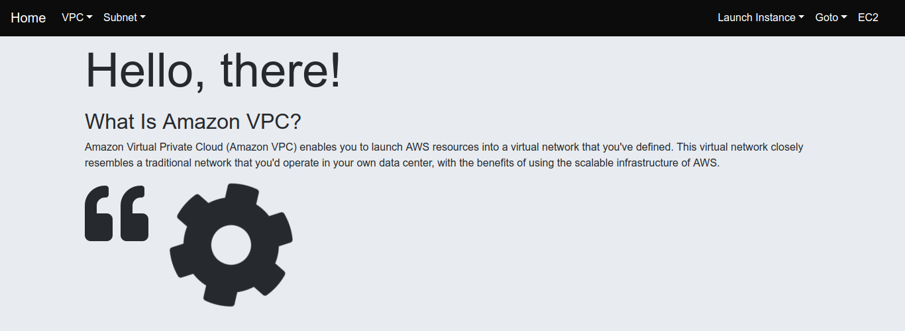

# Launch-EC2-Instance-Django



# Features

  * Get all existing Vpcs and Subnets informations. 
  * Launch AWS EC2 instance.

# Recommended Start

  ## Postgres Setup
  - Install the Components from the Ubuntu Repositories
  ```
  $ sudo apt-get update
  $ sudo apt-get install python-pip python-dev libpq-dev postgresql postgresql-contrib
  ```
  - During installation, an operating system user named postgres was created to correspond to the postgres PostgresSQL           administrative user, we can use this user or we can create a new database and a new user.
    
  - Create a New Database and New User which will use to connect to and interact with the database.
  - To enter in a shell session for the postgres user.
 ```
  $ sudo su - postgres
  $ psql
  ```
  - Create a database.
  ```
  CREATE DATABASE <database_name>;
  ```
  - Now create a  database user.
  ```
  CREATE USER <user_name> WITH PASSWORD 'password';
  ```
  - Setting default encoding to UTG-8, which Django expects.
  
  ```
  ALTER ROLE <user_name> SET client_encoding TO 'utf8';
  ALTER ROLE <user_name> SET default_transaction_isolation TO 'read committed';
  ALTER ROLE <user_name> SET timezone TO 'UTC';
  ```
  - Exit the SQL prompt to get back to the postgres user's shell session.
  ```
  \q
  ```
  - Exit out of the postgres user's shell sessionto get back to your regular user's shell session.
  ```
  exit
  ```
  
  - Create a virtual enviroment and clone it.
  
  ```
  $ sudo pip install virtualenv
  $ mkdir multicloud
  $ cd multicloud
  $ git clone <url> .
  $ virtualenv -p python3 .
  $ source bin/activate
  (multicloud) $ pip install -r requirements.txt
  ```
  
  - Create an .env file in root directory (where manage.py file exists) which consists the infomation regarding AWS Secret       Key Id and other details.
  - For Example:
  
    ```
    AWS_ACCESS_KEY_ID='<Key>'
    AWS_SECRET_ACCESS_KEY='<Access Key>'
    DB_NAME=<Database Name>
    DB_USER=<Databse User Name>
    DB_PASSWORD=<password>
    DB_HOST=localhost
    ```
  - Create initial Django migrations.
  
  ```
  $ python manage.py makemigrations
  $ python manage.py migrate
  ```
  ## Final step
  
  - Now run server.
  
  ```
  $ python manage.py runserver
  ```
  - Now open your browser and goto 127.0.0.1:8000 and you are all set to go.
  - Default port number is 8000 but  we can pass a different port number with runserver command. 
  
  
